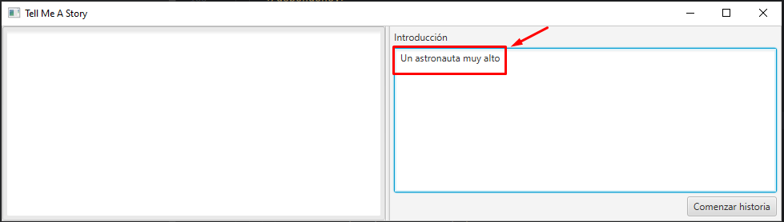
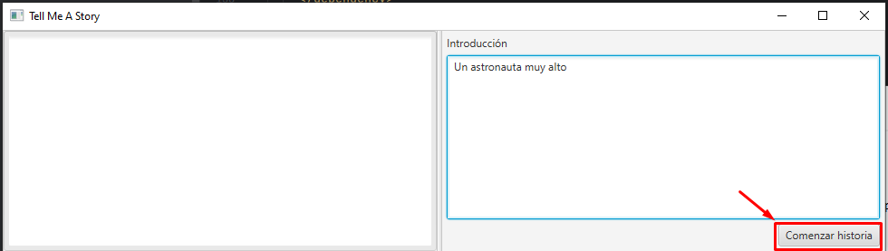
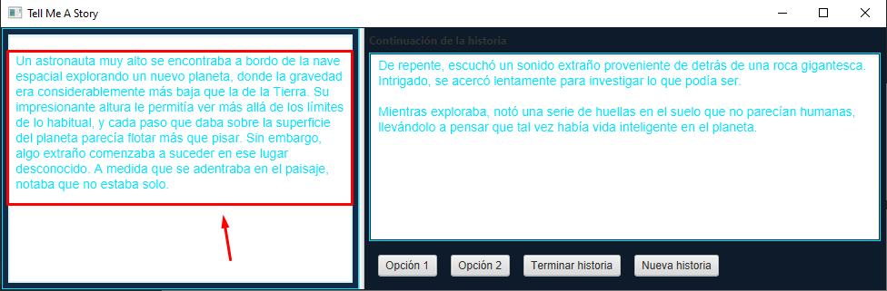
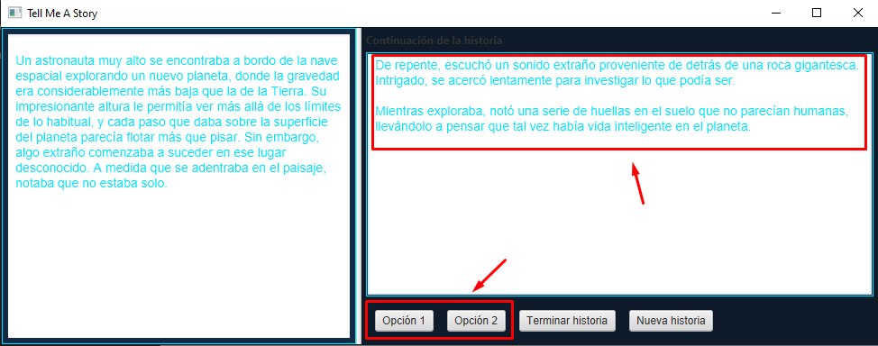
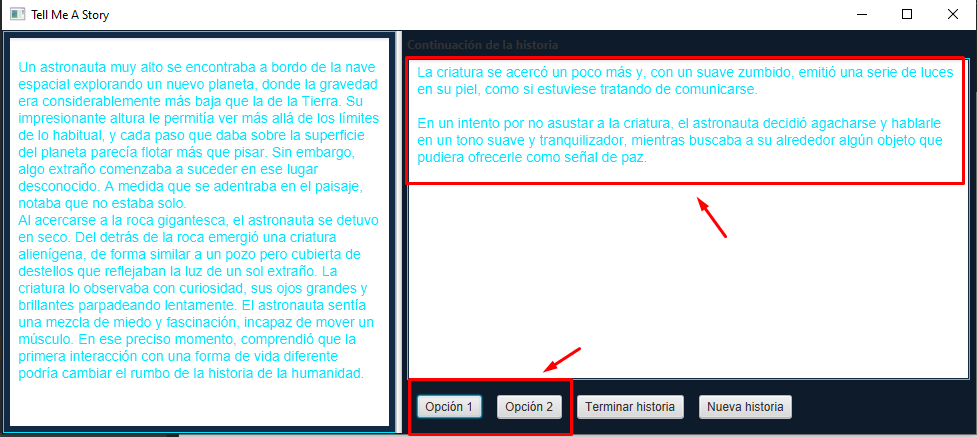
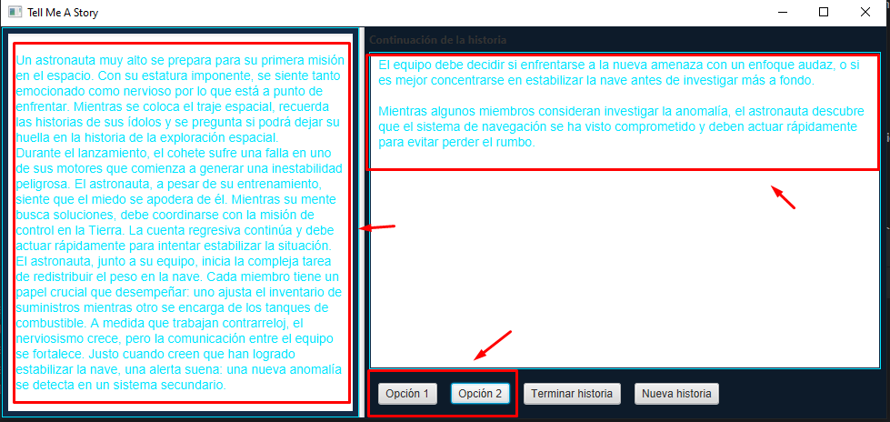
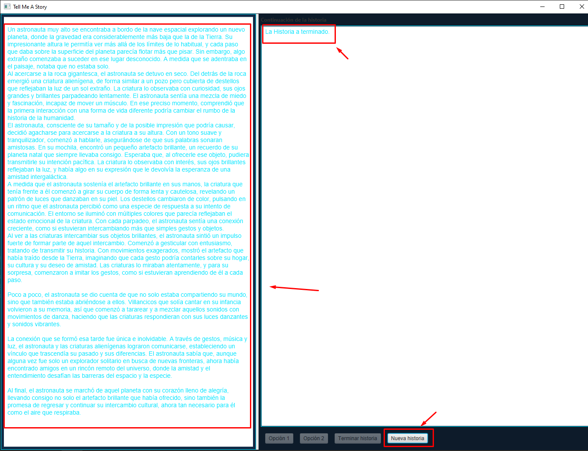
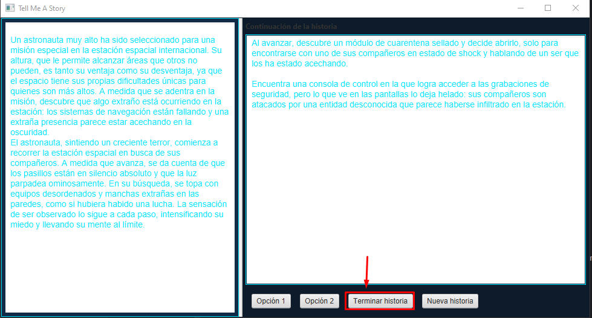

# TellMeAStory

## 📖 Descripción  
App para crear historias personalizadas introduciendo una introducción y seleccionando las opciones para desarrollarlas.

## 🛠️ Uso de la aplicación  

### 1️⃣ Introducir la introducción  
Lo primero que debemos hacer es introducir la introducción de la historia que deseamos desarrollar:  

### 2️⃣ Comenzar la historia  
Una vez introducida la introducción, debemos pulsar **"Comenzar historia"**:  

### 3️⃣ Generación de la historia  
Se generará una historia en la ventana izquierda:  

### 4️⃣ Seleccionar una opción  
Aparecerán dos opciones en el lado derecho, que son las posibles opciones que el usuario puede elegir para continuar la historia.  
Para elegirlas, el usuario simplemente debe pulsar uno de los botones con las opciones.  
  

### 5️⃣ Continuar con la historia  
Una vez seleccionada la opción, la historia en la izquierda se actualizará con el texto correspondiente a la opción elegida.  
  

### 6️⃣ Seleccionar otra opción  
Para continuar la historia, simplemente debemos seleccionar una opción como hicimos anteriormente.  
  

### 7️⃣ Finalizar historia  
Después de 5 interacciones, la historia llegará a su fin.  
El texto completo aparecerá a la izquierda y podremos empezar una nueva historia pulsando el botón **"Nueva historia"**.  
  

### 8️⃣ Finalizar historia antes  
Si deseamos finalizar la historia antes de completar 5 interacciones, simplemente debemos pulsar el botón **"Terminar historia"**.  
  
